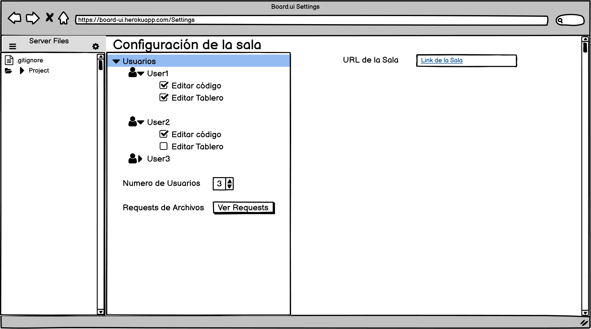
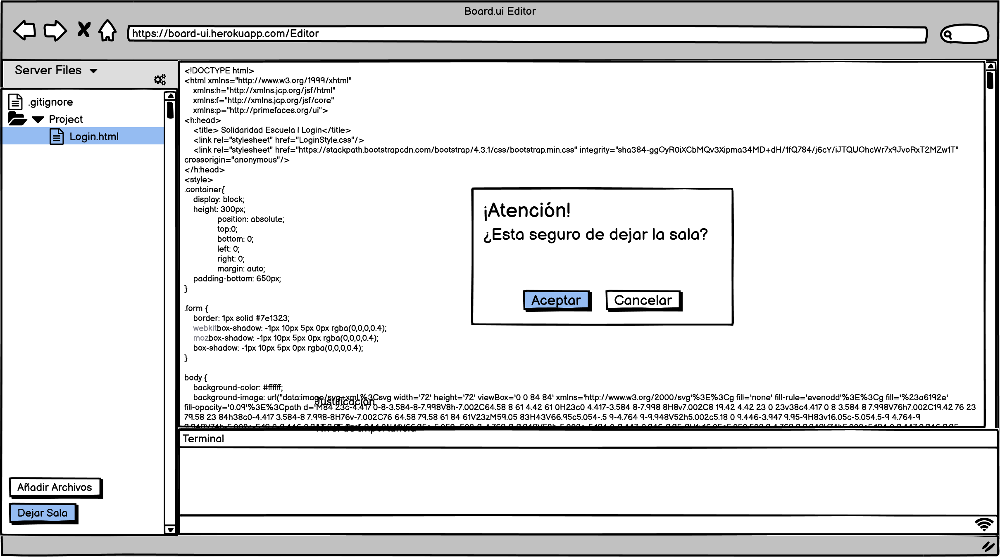
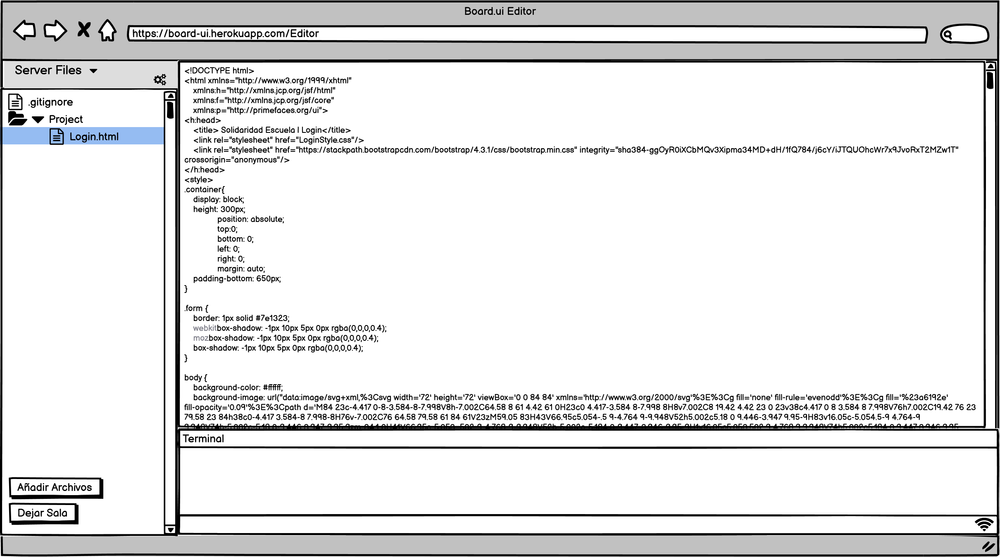
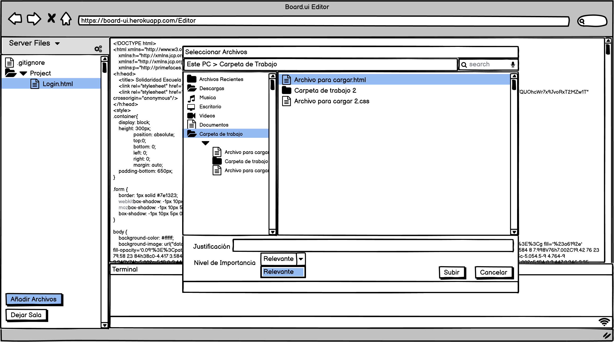
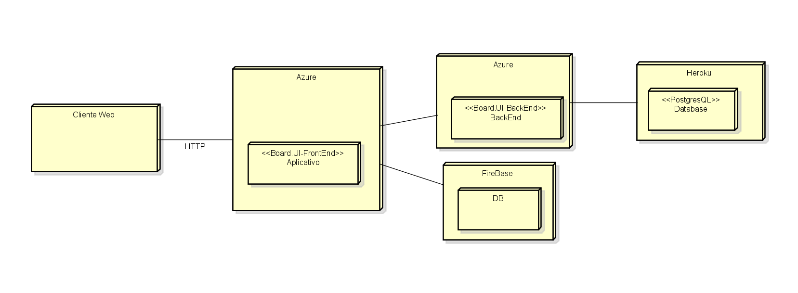
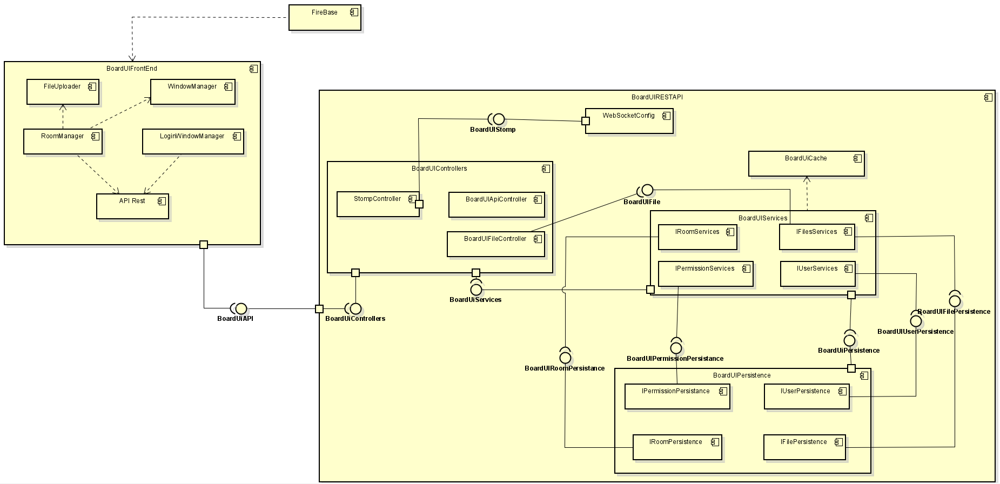

# BOARD.UI
# Integrantes
 - Angie Medina
 - Jose Perez
 - Luis Amaya
 - Sebastian Mina 
# Resumen
Tiempos modernos, UI’s modernas. Board.UI, es una herramienta para frontend developers que facilitará el flujo creativo de ideas y optimizará el proceso de creación de interfaces amigables para el usuario. 

## Descripcion

Board.UI es una herramienta de colaboración en tiempo real que permitirá a miles de desarrolladores frontend desplegar sus diseños e ideas de forma ágil. Con esta propuesta se busca mejorar el trabajo de equipos de desarrolladores frontend.

## Antecedentes

Los antecedentes que nos llevaron a pensar esta propuesta de proyecto fueron principalmente los editores de texto que normalmente usamos para el desarrollo de nuestros proyectos.

# Mockups 

### Login y SignUP

### Crear una Sala

### Unirse a una Sala

### Dejar una Sala

### Editor de texto

#### Subir archivos como Asistente de la sala

### Board

### Aceptar - Rechazar Requests

# Diagramas ✏️📐

### Diagrama Entidad Relación

### Diagrama de Despliegue

### Diagrma de Componentes

# Enlace Taiga :link:
https://tree.taiga.io/project/angiemeg-boardui/timeline

# Enlace Heroku :link:
https://board-ui.herokuapp.com/
