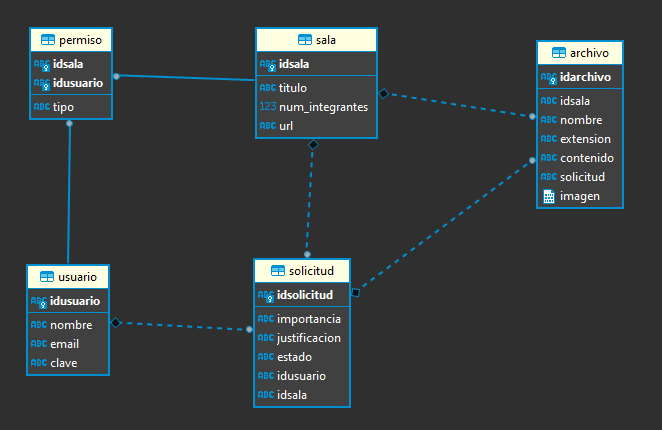
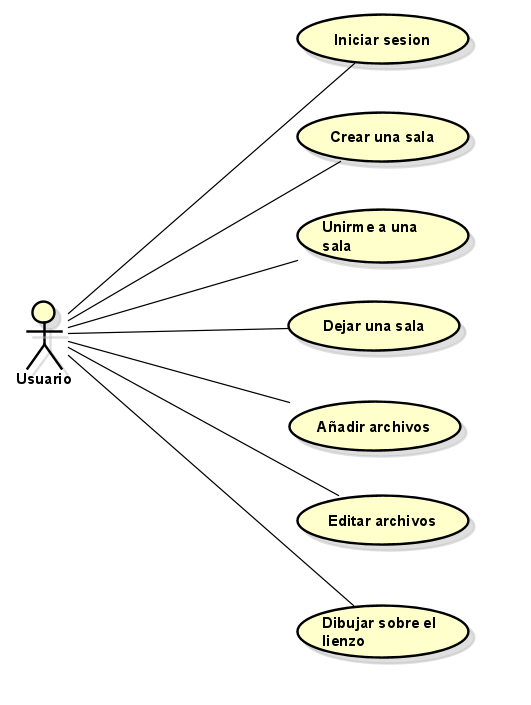
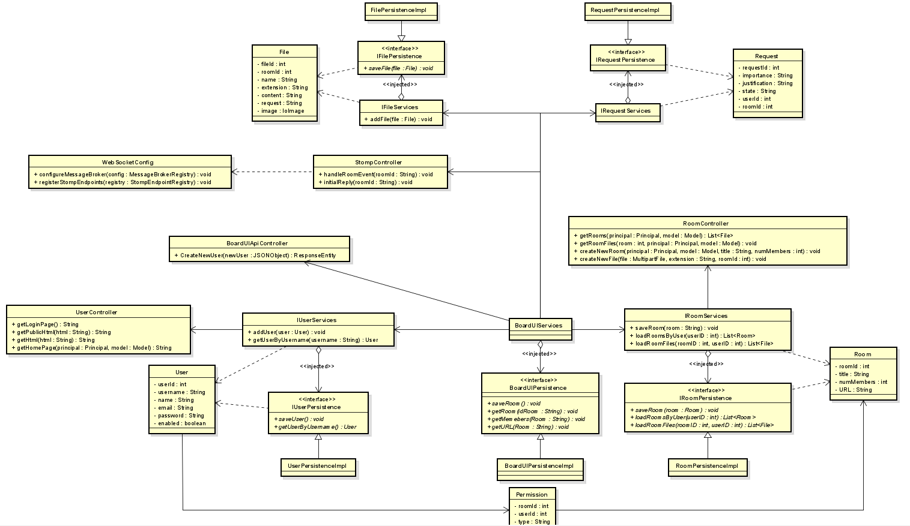

# BOARD.UI
## Integrantes
-  Angie Tatiana Medina Gil
-  Jose Ricardo Pérez de León
-  Luis Gerardo Amaya Ortíz
-  Juan Sebastián Mina Echavarría

## Presentado
Para la materia de **Arquitectura de Software (ARSW)** a **Sebastian Henao Pinzon**
 
## Resumen
Tiempos modernos, UI’s modernas. Board.UI, es una herramienta para frontend developers que facilitará el flujo creativo de ideas y optimizará el proceso de creación de interfaces amigables para el usuario. 

## Descripción

Board.UI es una herramienta de colaboración en tiempo real que permitirá a miles de desarrolladores frontend desplegar sus diseños e ideas de forma ágil. Con esta propuesta se busca mejorar el trabajo de equipos de desarrolladores frontend.

## Antecedentes

Los antecedentes que nos llevaron a pensar esta propuesta de proyecto fueron principalmente los editores de texto que normalmente usamos para el desarrollo de nuestros proyectos.

## Mockups 

### Login y SignUp

### Crear una Sala

### Unirse a una Sala

### Dejar una Sala

### Editor de texto

#### Subir archivos como Asistente de la sala

### Board

### Aceptar - Rechazar Requests

## Diagramas ✏️📐

### Diagrama Entidad Relación

### Diagrama Casos de uso

### Diagrama de Despliegue

### Diagrma de Componentes

### Diagrama de Clases

## Requerimientos no funcionales
### Usabilidad
* **Aesthetic and Minimalista Design:** Se tiene un diseño minimalista puesto que el usuario en todas las instancias de uso de la aplicación solo se le muestra la información necesaria/relevante para lo que esta realizando. Por ejemplo
  * Aunque el usuario pertenezca a una sala, la lista de los archivos de esta no sera visible a menos que el usuario seleccione la sala
  * Cuando se selecciona una sala, no se tiene visibilidad del contenido de los archivos a menos que se seleccione
  * Al desconectarse de una sala, la lista de los archivos no sera visible
* **Help and Documentation:** La aplicación cuenta con un manual de usuario, el cual explica todas las acciones que se pueden realizar junto con descripciones y demostraciones visuales.

## Enlace🔗
http://board-ui.azurewebsites.net/  

## Enlace Taiga 🔗
https://tree.taiga.io/project/angiemeg-boardui/timeline

